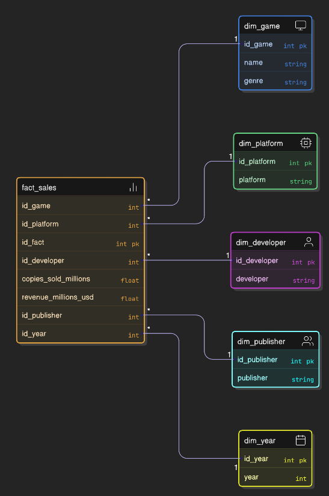
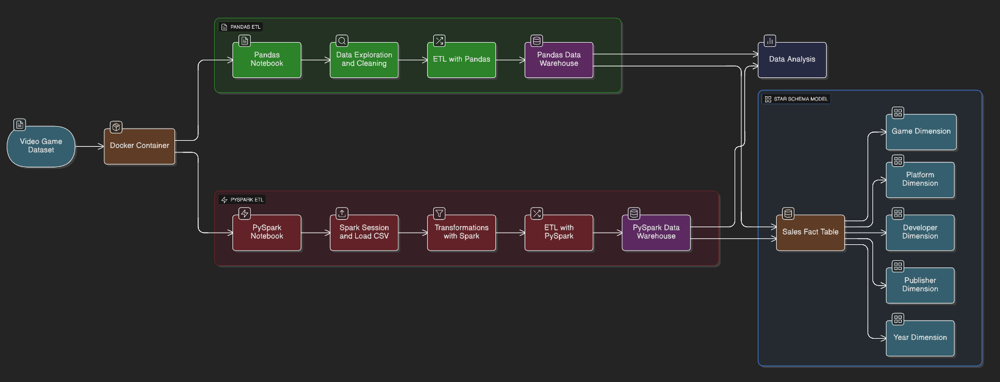

# Proyecto RA1 – Análisis y Procesamiento de Datos con Videogames

## 1. Descripción del Proyecto

Este proyecto implementa un flujo completo de **análisis y procesamiento de datos** sobre un dataset de videojuegos (`data/videogames.csv`) utilizando **Pandas** y **PySpark**.  
Se construyen **dos procesos ETL paralelos** (uno con Pandas y otro con PySpark) que cargan los resultados en dos bases de datos **SQLite** (`warehouse_pandas.db` y `warehouse_pyspark.db`) siguiendo un **modelo dimensional en estrella**.

El proyecto está pensado como un caso realista de data analytics / data engineering y es totalmente ejecutable tanto **con Docker** como **sin Docker**.

---

## 2. Herramientas Utilizadas

- **Pandas**: Exploración, limpieza y transformación de datos
- **PySpark**: Procesamiento distribuido de datos
- **Jupyter Notebook**: Entorno interactivo de desarrollo
- **SQLite**: Base de datos para el Data Warehouse
- **SQLAlchemy**: ORM para la carga de datos en SQLite
- **Docker**: Contenedorización del entorno del proyecto
- **Docker Compose**: Orquestación de servicios

---

## 3. Estructura del Proyecto

```
proyecto-ra1/
├── data/
│   └── videogames.csv                    # Dataset original
├── notebooks/
│   ├── 01_pandas.ipynb                   # ETL con Pandas
│   └── 02_pyspark.ipynb                  # ETL con PySpark
├── warehouse/
│   ├── modelo_datawarehouse_pandas.sql   # DDL del modelo Pandas
│   ├── modelo_datawarehouse_pyspark.sql  # DDL del modelo PySpark
│   ├── warehouse_pandas.db               # Base de datos SQLite (Pandas)
│   └── warehouse_pyspark.db              # Base de datos SQLite (PySpark)
├── docs/
│   ├── README.md                         # Esta documentación
│   └── diagrama.png                      # Diagrama del modelo dimensional
├── Dockerfile                            # Configuración del contenedor
└── docker-compose.yml                    # Orquestación de servicios
```

---

## 4. Explicación Detallada de Cada Fase

### 4.1 Fase 1: Exploración y Limpieza con Pandas (`01_pandas.ipynb`)

#### Objetivos:
- Explorar el dataset de videojuegos
- Identificar y tratar valores faltantes y duplicados
- Normalizar y transformar columnas
- Preparar los datos para el proceso ETL

#### Pasos realizados:

1. **Carga del dataset**
   - Lectura del CSV desde `data/videogames.csv`
   - Inspección de tipos de datos, dimensiones y estadísticas descriptivas

2. **Limpieza de datos**
   - Eliminación de filas duplicadas
   - Tratamiento de valores faltantes:
     - Columnas numéricas (`copies_sold_millions`, `revenue_millions_usd`): imputación con la media
     - Columnas categóricas: relleno con `"Unknown"`
   - Limpieza de valores problemáticos (formato de millones/billones, símbolos de moneda)

3. **Normalización**
   - Conversión de nombres de columnas a `snake_case`
   - Estandarización de formatos

### 4.2 Fase 2: Procesamiento con PySpark (`02_pyspark.ipynb`)

#### Objetivos:
- Replicar el flujo de limpieza usando PySpark
- Aplicar transformaciones distribuidas
- Demostrar el uso de Spark para procesamiento de datos a escala

#### Pasos realizados:

1. **Creación de SparkSession**
   - Configuración de la sesión de Spark
   - Definición de rutas de datos y base de datos

2. **Carga del dataset**
   - Lectura del CSV con inferencia de esquema
   - Visualización del esquema y primeras filas

3. **Transformaciones con Spark**
   - Eliminación de duplicados con `dropDuplicates()`
   - Tratamiento de nulos:
     - Columnas numéricas: imputación con media calculada con Spark
     - Columnas categóricas: relleno con `"Unknown"`
   - Normalización de nombres de columnas

### 4.3 Fase 3: Proceso ETL con Pandas

#### 🔄 Explicación Detallada del Proceso ETL

##### 1. Extracción (E)

**Archivos origen:**
- `data/videogames.csv`

**Acciones realizadas:**
- Lectura del archivo CSV desde la carpeta `/data`
- Carga en un DataFrame de Pandas
- Verificación de integridad de los datos

##### 2. Transformación (T)

**Objetivos:**
- Limpiar y normalizar los datos
- Crear un modelo dimensional (esquema en estrella)
- Separar dimensiones y hechos

**Pasos realizados:**

1. **Limpieza de datos:**
   - Eliminación de duplicados
   - Tratamiento de valores faltantes
   - Normalización de columnas numéricas (conversión de formatos como "1.5M" a valores numéricos)
   - Imputación de valores categóricos faltantes

2. **Creación de dimensiones:**
   - `dim_game`: Información única de cada juego (nombre, género)
   - `dim_platform`: Catálogo de plataformas
   - `dim_developer`: Información de desarrolladores
   - `dim_publisher`: Información de publishers
   - `dim_year`: Catálogo de años

3. **Construcción de la tabla de hechos:**
   - `fact_sales`: Tabla de hechos con relaciones a todas las dimensiones
   - Métricas incluidas:
     - `copies_sold_millions`: Copias vendidas en millones
     - `revenue_millions_usd`: Ingresos en millones de dólares

##### 3. Carga (L)

**Destino:**
- Base de datos SQLite: `warehouse/warehouse_pandas.db`

**Método:**
- Uso de SQLAlchemy para crear la conexión
- Carga de tablas mediante `to_sql()` de Pandas
- Creación de todas las tablas dimensionales y la tabla de hechos

### 4.4 Fase 4: Proceso ETL con PySpark

#### 🔄 Explicación Detallada del Proceso ETL

##### 1. Extracción (E)

**Archivos origen:**
- `data/videogames.csv`

**Acciones realizadas:**
- Lectura del archivo CSV desde la carpeta `/data` usando Spark
- Carga en un Spark DataFrame con `spark.read.csv()`
- Configuración de `header=True` para usar la primera fila como encabezados
- Configuración de `inferSchema=True` para detectar automáticamente tipos de datos
- Verificación de dimensiones y primeras filas

##### 2. Transformación (T)

**Objetivos:**
- Limpiar y normalizar los datos usando PySpark
- Crear un modelo dimensional (esquema en estrella) idéntico al de Pandas
- Separar dimensiones y hechos de forma distribuida

**Pasos realizados:**

1. **Limpieza de datos:**
   - Eliminación de duplicados con `dropDuplicates()`
   - Tratamiento de valores problemáticos ("?", "N/A", "") reemplazándolos con "Unknown"
   - Normalización de columnas numéricas:
     - Conversión de formatos especiales (valores terminados en "M" para millones, "B" para billones)
     - Imputación de nulos con la media calculada usando `F.mean()`
   - Limpieza de columnas categóricas:
     - Eliminación de espacios con `F.trim()`
     - Reemplazo de valores problemáticos con "Unknown"

2. **Normalización:**
   - Conversión de nombres de columnas a `snake_case` usando `toDF()`
   - Estandarización de formatos

3. **Creación de dimensiones:**
   - `dim_game`: Información única de cada juego (nombre, género)
   - `dim_platform`: Catálogo de plataformas
   - `dim_developer`: Información de desarrolladores
   - `dim_publisher`: Información de publishers
   - `dim_year`: Catálogo de años
   - Obtención de valores únicos con `distinct()` y `orderBy()`
   - Conversión temporal a Pandas para asignar IDs autoincrementales
   - Recreación como DataFrames de Spark para los joins

4. **Construcción de la tabla de hechos:**
   - `fact_sales`: Tabla de hechos con relaciones a todas las dimensiones
   - Joins izquierdos (`how='left'`) entre el dataset limpio y las dimensiones
   - Selección de IDs de dimensiones y métricas (`copies_sold_millions`, `revenue_millions_usd`)

##### 3. Carga (L)

**Destino:**
- Base de datos SQLite: `warehouse/warehouse_pyspark.db`

**Método:**
- Uso de **Spark JDBC** (Java Database Connectivity) para escribir directamente en SQLite
- Configuración del driver JDBC de SQLite: `org.sqlite.JDBC`
- Método `spark.write.jdbc()` para escribir DataFrames directamente sin conversión a Pandas
- Modo `overwrite` para sobrescribir tablas existentes
- Creación automática de la carpeta `warehouse` si no existe

**Alternativa (si JDBC no está disponible):**
- Conversión de DataFrames de Spark a Pandas con `toPandas()`
- Carga en SQLite mediante SQLAlchemy con `to_sql()` e `if_exists="replace"`
- Uso de transacciones con `engine.begin()` para garantizar atomicidad

---

## 5. Modelo de Data Warehouse

### 5.1 Esquema en Estrella

El modelo dimensional implementado es un **esquema en estrella** con:

- **1 tabla de hechos**: `fact_sales`
- **5 tablas de dimensiones**: `dim_game`, `dim_platform`, `dim_developer`, `dim_publisher`, `dim_year`

### 5.2 DDL de las Tablas

Los DDLs completos están disponibles en:
- `warehouse/modelo_datawarehouse_pandas.sql`
- `warehouse/modelo_datawarehouse_pyspark.sql`

#### Tabla de hechos: `fact_sales`

```sql
CREATE TABLE fact_sales (
    id_fact INTEGER PRIMARY KEY AUTOINCREMENT,
    id_game INTEGER,
    id_platform INTEGER,
    id_developer INTEGER,
    id_publisher INTEGER,
    id_year INTEGER,
    copies_sold_millions REAL,
    revenue_millions_usd REAL,
    FOREIGN KEY (id_game) REFERENCES dim_game(id_game),
    FOREIGN KEY (id_platform) REFERENCES dim_platform(id_platform),
    FOREIGN KEY (id_developer) REFERENCES dim_developer(id_developer),
    FOREIGN KEY (id_publisher) REFERENCES dim_publisher(id_publisher),
    FOREIGN KEY (id_year) REFERENCES dim_year(id_year)
);
```

#### Tablas de dimensiones

**dim_game:**
```sql
CREATE TABLE dim_game (
    id_game INTEGER PRIMARY KEY AUTOINCREMENT,
    name TEXT NOT NULL,
    genre TEXT
);
```

**dim_platform:**
```sql
CREATE TABLE dim_platform (
    id_platform INTEGER PRIMARY KEY AUTOINCREMENT,
    platform TEXT NOT NULL
);
```

**dim_developer:**
```sql
CREATE TABLE dim_developer (
    id_developer INTEGER PRIMARY KEY AUTOINCREMENT,
    developer TEXT NOT NULL
);
```

**dim_publisher:**
```sql
CREATE TABLE dim_publisher (
    id_publisher INTEGER PRIMARY KEY AUTOINCREMENT,
    publisher TEXT NOT NULL
);
```

**dim_year:**
```sql
CREATE TABLE dim_year (
    id_year INTEGER PRIMARY KEY AUTOINCREMENT,
    year INTEGER NOT NULL
);
```

### 5.3 Diagrama del Modelo Dimensional



---

## 6. Diagrama del Flujo del Proyecto



```

---

## 7. Instrucciones de Ejecución

### 7.1 Ejecución con Docker (Recomendado)

**Requisitos:**
- Docker instalado
- Docker Compose instalado

**Pasos:**

1. Construir la imagen Docker:
   ```bash
   docker-compose build
   ```

2. Levantar el servicio:
   ```bash
   docker-compose up
   ```

3. Acceder a Jupyter Notebook:
   - Abrir el navegador en: `http://localhost:8888`
   - Navegar a la carpeta `notebooks/`
   - Ejecutar en orden:
     - `01_pandas.ipynb` (genera `warehouse_pandas.db`)
     - `02_pyspark.ipynb` (genera `warehouse_pyspark.db`)

**El Dockerfile incluye:**
- Python 3.9
- Java (para PySpark)
- Librerías: `pandas`, `pyspark`, `sqlalchemy`, `jupyter`

### 7.2 Ejecución sin Docker

**Requisitos:**
- Python 3.9+
- Java 11 o superior (necesario para PySpark)

**Instalación de dependencias:**

```bash
pip install pandas pyspark sqlalchemy jupyter
```

**Pasos:**

1. Situarse en la raíz del proyecto
2. Iniciar Jupyter Notebook:
   ```bash
   jupyter notebook
   ```
3. Abrir y ejecutar los notebooks en orden:
   - `notebooks/01_pandas.ipynb`
   - `notebooks/02_pyspark.ipynb`

**Resultado:**
Al finalizar, se habrán creado las bases de datos:
- `warehouse/warehouse_pandas.db`
- `warehouse/warehouse_pyspark.db`

---

## 8. Cómo se Cargaron los Datos en SQLite

### 8.1 Proceso de Carga con Pandas

1. **Creación de la conexión:**
   - Uso de SQLAlchemy para crear un engine de conexión
   - Ruta: `sqlite:///warehouse/warehouse_pandas.db`
   - Creación de la carpeta `warehouse` si no existe

2. **Carga de tablas:**
   - Uso directo de `to_sql()` sobre DataFrames de Pandas
   - Todas las tablas se cargan dentro de una transacción con `engine.begin()`

3. **Orden de carga:**
   - Primero se cargan las tablas de dimensiones (sin dependencias):
     - `dim_game`
     - `dim_platform`
     - `dim_developer`
     - `dim_publisher`
     - `dim_year`
   - Luego se carga la tabla de hechos (con claves foráneas):
     - `fact_sales`

4. **Manejo de errores:**
   - Uso de `if_exists="replace"` para sobrescribir tablas existentes
   - Transacciones con `engine.begin()` para garantizar atomicidad

### 8.2 Proceso de Carga con PySpark

1. **Preparación del entorno:**
   - Creación de la carpeta `warehouse` si no existe usando `os.makedirs("../warehouse", exist_ok=True)`
   - Configuración de la ruta de la base de datos: `../warehouse/warehouse_pyspark.db`
   - Creación del engine de SQLAlchemy: `sqlalchemy.create_engine(DB_URL)`

2. **Conversión de DataFrames:**
   - Los DataFrames de Spark se convierten a Pandas usando `toPandas()`:
     ```python
     dim_game.toPandas().to_sql("dim_game", conn, if_exists="replace", index=False)
     dim_platform.toPandas().to_sql("dim_platform", conn, if_exists="replace", index=False)
     dim_developer.toPandas().to_sql("dim_developer", conn, if_exists="replace", index=False)
     dim_publisher.toPandas().to_sql("dim_publisher", conn, if_exists="replace", index=False)
     dim_year.toPandas().to_sql("dim_year", conn, if_exists="replace", index=False)
     fact_sales.toPandas().to_sql("fact_sales", conn, if_exists="replace", index=False)
     ```

3. **Carga en SQLite:**
   - Todas las conversiones y cargas se realizan dentro de una transacción única con `engine.begin()`
   - Esto garantiza que si falla alguna carga, se revierte toda la operación
   - Uso de `if_exists="replace"` para sobrescribir tablas existentes
   - `index=False` para evitar guardar el índice de Pandas como columna adicional

4. **Ventajas del enfoque:**
   - Aprovecha el procesamiento distribuido de Spark para la transformación
   - Utiliza la simplicidad de Pandas/SQLAlchemy para la carga en SQLite
   - Mantiene la integridad transaccional de los datos

### 8.3 Diferencias entre Pandas y PySpark

| Aspecto | Pandas | PySpark |
|---------|--------|---------|
| **Procesamiento** | En memoria (single machine) | Distribuido (cluster) |
| **Carga a SQLite** | Directo con `to_sql()` | Conversión a Pandas primero con `toPandas()` |
| **Escalabilidad** | Limitada por RAM | Escalable a grandes volúmenes |
| **Sintaxis** | Más intuitiva | Más verbosa pero potente |
| **Resultado** | Mismo modelo dimensional | Mismo modelo dimensional |

---

## 9. Consultas y Queries que se Pueden Realizar

### 9.1 Ventas Totales por Género

```sql
SELECT 
    g.genre, 
    SUM(f.copies_sold_millions) AS total_copies_sold,
    SUM(f.revenue_millions_usd) AS total_revenue
FROM fact_sales f
JOIN dim_game g ON f.id_game = g.id_game
GROUP BY g.genre
ORDER BY total_copies_sold DESC;
```

**Pregunta:** ¿Cuál es el género con más copias vendidas?

### 9.2 Ventas Totales por Plataforma

```sql
SELECT 
    p.platform, 
    SUM(f.copies_sold_millions) AS total_copies_sold,
    SUM(f.revenue_millions_usd) AS total_revenue
FROM fact_sales f
JOIN dim_platform p ON f.id_platform = p.id_platform
GROUP BY p.platform
ORDER BY total_copies_sold DESC;
```

**Pregunta:** ¿Qué plataforma tiene más ventas?

### 9.3 Top 10 Juegos por Ventas

```sql
SELECT 
    g.name, 
    g.genre,
    SUM(f.copies_sold_millions) AS total_copies_sold,
    SUM(f.revenue_millions_usd) AS total_revenue
FROM fact_sales f
JOIN dim_game g ON f.id_game = g.id_game
GROUP BY g.name, g.genre
ORDER BY total_copies_sold DESC
LIMIT 10;
```

**Pregunta:** ¿Cuáles son los 10 juegos más vendidos?

### 9.4 Ventas por Desarrollador

```sql
SELECT 
    d.developer,
    COUNT(DISTINCT f.id_game) AS num_games,
    SUM(f.copies_sold_millions) AS total_copies_sold,
    SUM(f.revenue_millions_usd) AS total_revenue
FROM fact_sales f
JOIN dim_developer d ON f.id_developer = d.id_developer
GROUP BY d.developer
ORDER BY total_revenue DESC;
```

**Pregunta:** ¿Qué desarrollador genera más ingresos?

### 9.5 Evolución de Ventas por Año

```sql
SELECT 
    y.year,
    COUNT(DISTINCT f.id_game) AS num_games,
    SUM(f.copies_sold_millions) AS total_copies_sold,
    AVG(f.copies_sold_millions) AS avg_copies_per_game
FROM fact_sales f
JOIN dim_year y ON f.id_year = y.id_year
GROUP BY y.year
ORDER BY y.year;
```

**Pregunta:** ¿Cómo ha evolucionado el promedio de ventas por juego a lo largo de los años?

### 9.6 Análisis por Publisher y Plataforma

```sql
SELECT 
    pub.publisher,
    p.platform,
    SUM(f.copies_sold_millions) AS total_copies_sold
FROM fact_sales f
JOIN dim_publisher pub ON f.id_publisher = pub.id_publisher
JOIN dim_platform p ON f.id_platform = p.id_platform
GROUP BY pub.publisher, p.platform
ORDER BY total_copies_sold DESC
LIMIT 20;
```

**Pregunta:** ¿Qué combinación de publisher y plataforma tiene más éxito?

### 9.7 Géneros Más Rentables

```sql
SELECT 
    g.genre,
    SUM(f.copies_sold_millions) AS total_copies,
    SUM(f.revenue_millions_usd) AS total_revenue,
    SUM(f.revenue_millions_usd) / NULLIF(SUM(f.copies_sold_millions), 0) AS revenue_per_copy
FROM fact_sales f
JOIN dim_game g ON f.id_game = g.id_game
WHERE f.copies_sold_millions > 0
GROUP BY g.genre
ORDER BY revenue_per_copy DESC;
```

**Pregunta:** ¿Qué género genera más ingresos por copia vendida?

---

## 10. Conclusiones y Aprendizajes

### 10.1 Conclusiones

Este proyecto demuestra un flujo completo de análisis y procesamiento de datos, desde la exploración inicial hasta la carga en un Data Warehouse estructurado. Se han implementado dos enfoques paralelos (Pandas y PySpark) que permiten comparar las ventajas de cada herramienta:

- **Pandas**: Ideal para datasets que caben en memoria, con sintaxis intuitiva y operaciones rápidas
- **PySpark**: Escalable para grandes volúmenes de datos, con capacidades de procesamiento distribuido

### 10.2 Aprendizajes Clave

1. **Exploración de datos:**
   - La importancia de una exploración exhaustiva antes de cualquier transformación
   - Identificación temprana de problemas de calidad de datos

2. **Limpieza de datos:**
   - Estrategias diferentes para valores numéricos vs categóricos
   - Manejo de formatos inconsistentes (valores con "M", "B", símbolos de moneda)

3. **Modelado dimensional:**
   - Diseño de esquemas en estrella para facilitar consultas analíticas
   - Separación clara entre dimensiones y hechos

4. **ETL:**
   - Estructuración del proceso en fases claras (Extracción, Transformación, Carga)
   - Importancia de mantener la trazabilidad de los datos

5. **Docker:**
   - Contenedorización facilita la reproducibilidad del entorno
   - Simplifica la instalación de dependencias complejas (Java para PySpark)

### 10.3 Aplicaciones Prácticas

Este proyecto puede servir como base para:
- Análisis de ventas y rendimiento de productos
- Identificación de tendencias de mercado
- Optimización de estrategias de publicación
- Análisis de rendimiento por plataforma o región

### 10.4 Mejoras Futuras

Posibles extensiones del proyecto:
- Incorporación de más fuentes de datos
- Implementación de procesos ETL incrementales
- Adición de más métricas calculadas
- Visualizaciones con herramientas como Matplotlib o Plotly
- Implementación de un proceso de orquestación (Airflow, Prefect)

---

## 11. Información Adicional

### Estructura de Archivos Generados

Después de ejecutar los notebooks, la carpeta `warehouse/` contendrá:

- `warehouse_pandas.db`: Base de datos SQLite con el modelo dimensional generado por Pandas
- `warehouse_pyspark.db`: Base de datos SQLite con el modelo dimensional generado por PySpark
- `modelo_datawarehouse_pandas.sql`: DDL del modelo para referencia
- `modelo_datawarehouse_pyspark.sql`: DDL del modelo para referencia

### Verificación de la Carga

Para verificar que los datos se cargaron correctamente, puedes ejecutar:

```python
import sqlalchemy
import pandas as pd

# Para Pandas
engine_pandas = sqlalchemy.create_engine('sqlite:///warehouse/warehouse_pandas.db')
pd.read_sql("SELECT COUNT(*) FROM fact_sales", engine_pandas)

# Para PySpark
engine_pyspark = sqlalchemy.create_engine('sqlite:///warehouse/warehouse_pyspark.db')
pd.read_sql("SELECT COUNT(*) FROM fact_sales", engine_pyspark)
```

---

**Proyecto desarrollado como parte del curso RA1 - Análisis y Procesamiento de Datos**

